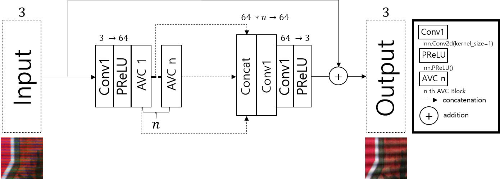
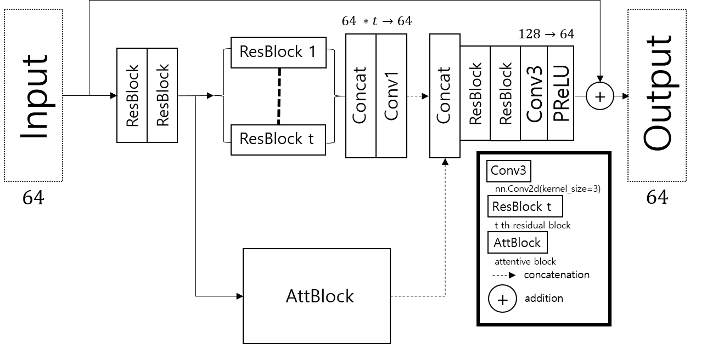
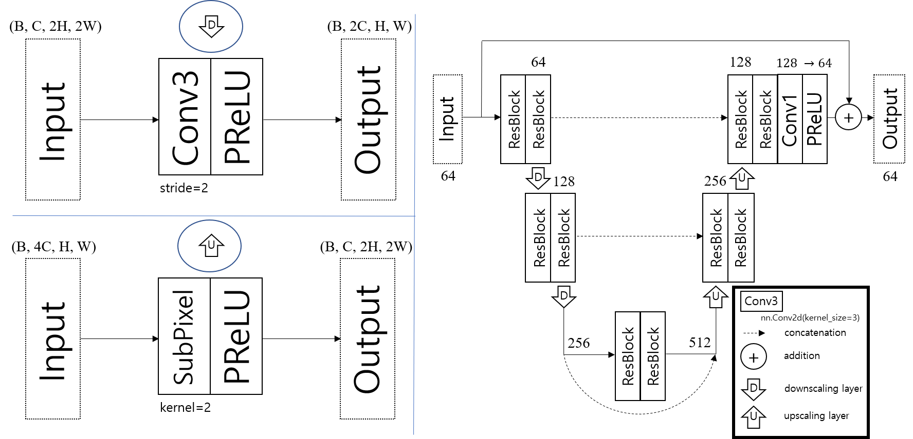
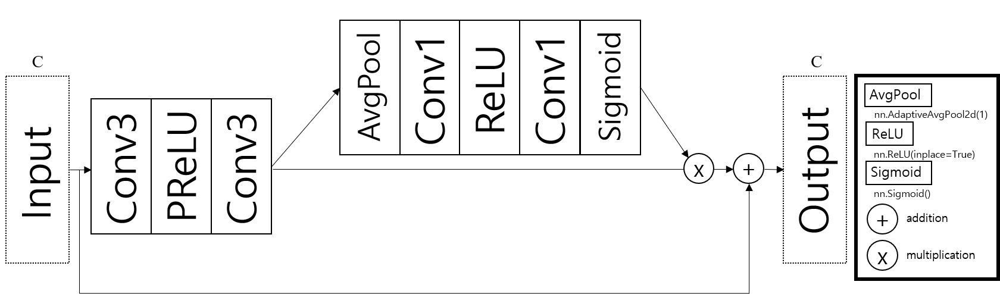
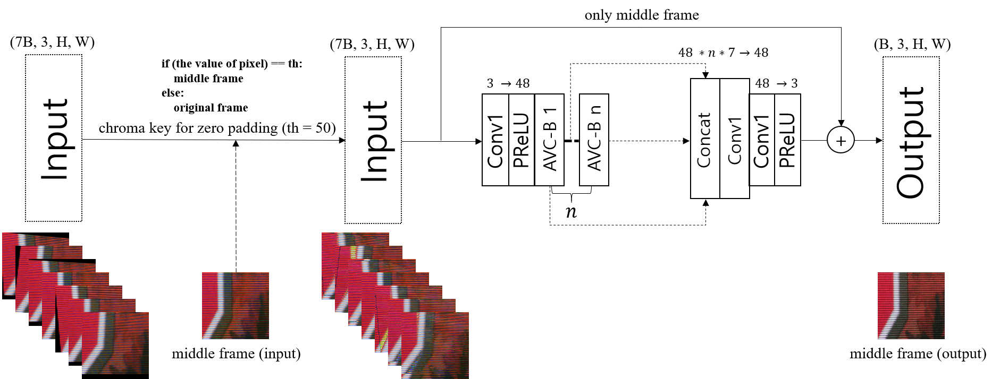
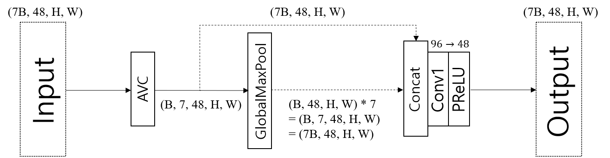

# C3Net
This is a PyTorch implementation of the [New Trends in Image Restoration and Enhancement workshop and challenges on image and video restoration and enhancement (NTIRE 2020 with CVPR 2020)](https://data.vision.ee.ethz.ch/cvl/ntire20/) paper, [C3Net: Demoireing Network Attentive in Channel, Color and Concatenation](NTIRE_C3Net.pdf).

If you find our project useful in your research, please consider citing:
~~~
@inproceedings{kim2020c3net,
  title={C3Net: Demoireing Network Attentive in Channel, Color and Concatenation},
  author={Kim, Sangmin and Nam, Hyungjoon and Kim, Jisu and Jeong, Jechang},
  booktitle={Proceedings of the IEEE Conference on Computer Vision and Pattern Recognition Workshops},
  year={2020}
~~~

# Dependencies
Python 3.6.9   
PyTorch 1.4.0 

# Data
[Reference](https://competitions.codalab.org/competitions/22223#participate-get_data)

# Proposed algorithm
   
   
   
   
   
   

# Training
Use the following command to use our training codes
~~~
python train.py
~~~
For training pre-trained model, download the model first.  
[trained model (Track 1: Single Image)](https://drive.google.com/open?id=1UX9Q-OzcRHuDZ0ZRjGO-j7UdghNwL_lV)  
[trained model (Track 2: Burst)](https://drive.google.com/open?id=1pzT2OMAmq7yEhmF_NQqiFwwg4FbofaOk)  
Then, set the option --resume to where the downloaded model is.  
There are other options you can choose.
Please refer to train.py.

# Test
Use the following command to use our test codes
~~~
python test.py
~~~
For testing pre-trained model, download the model first.  
[trained model (Track 1: Single Image)](https://drive.google.com/open?id=1UX9Q-OzcRHuDZ0ZRjGO-j7UdghNwL_lV)  
[trained model (Track 2: Burst)](https://drive.google.com/open?id=1pzT2OMAmq7yEhmF_NQqiFwwg4FbofaOk)  
Then, set the option --logdir to where the downloded model is.  
There are other options you can choose.
Please refer to test.py.

# Results

# Contact
If you have any question about the code or paper, feel free to ask me to <ksmh1652@gmail.com>.

# Acknowledgement
Thanks for [SaoYan](https://github.com/SaoYan/DnCNN-PyTorch) who gave the implementaion of DnCNN.

