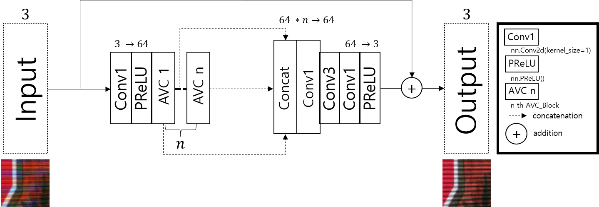
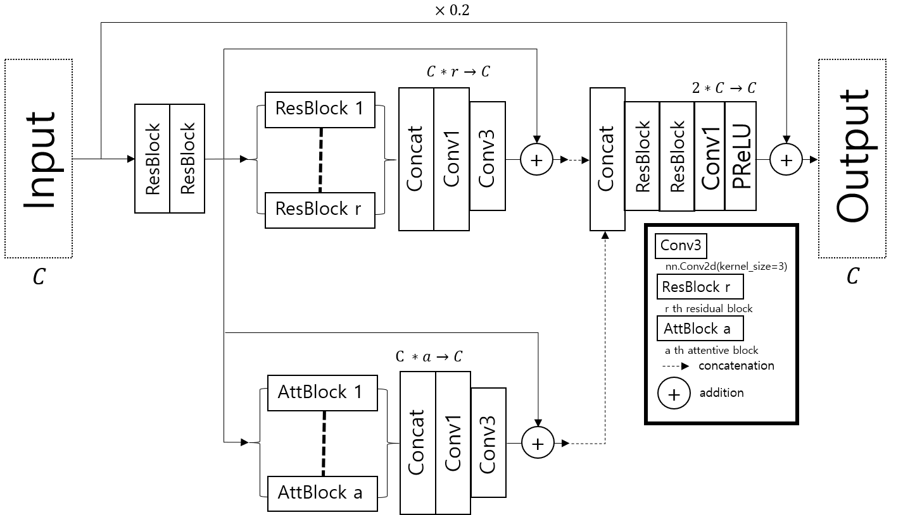
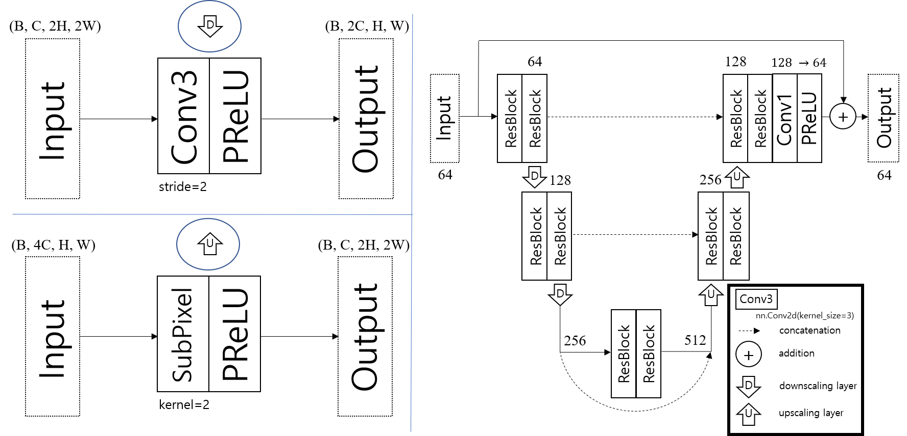
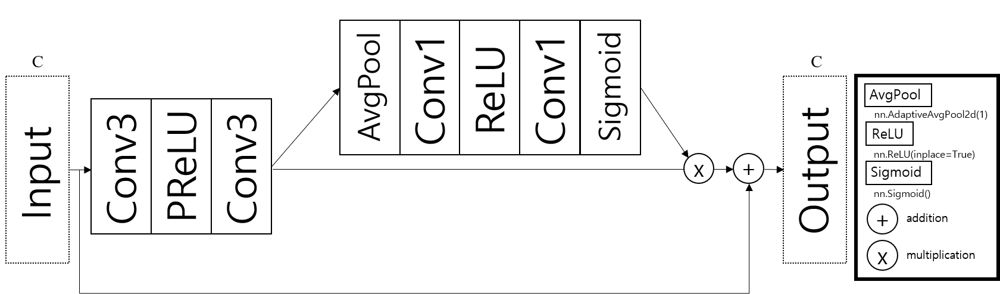
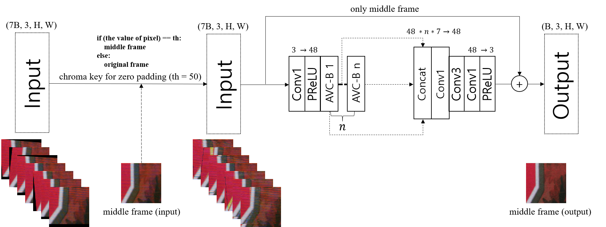
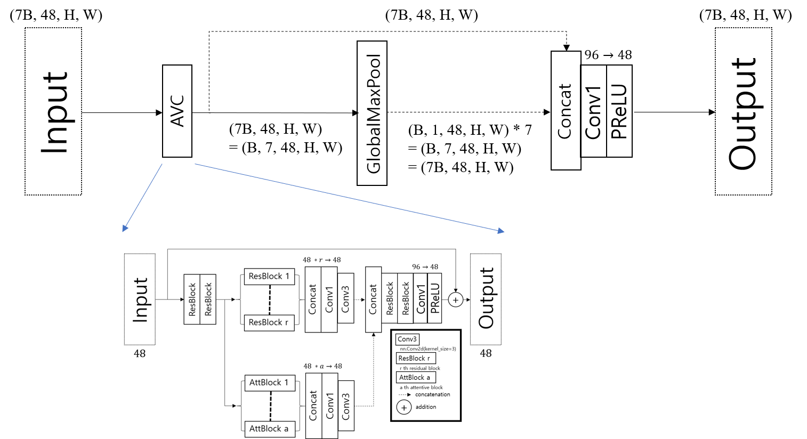
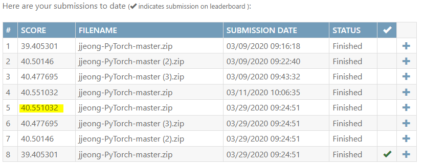
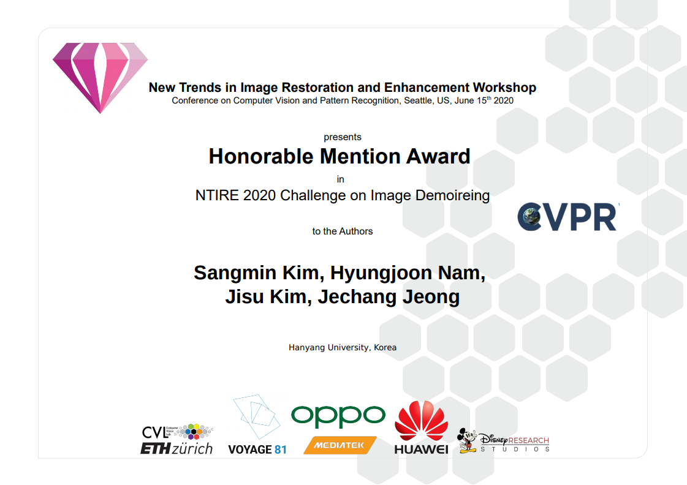
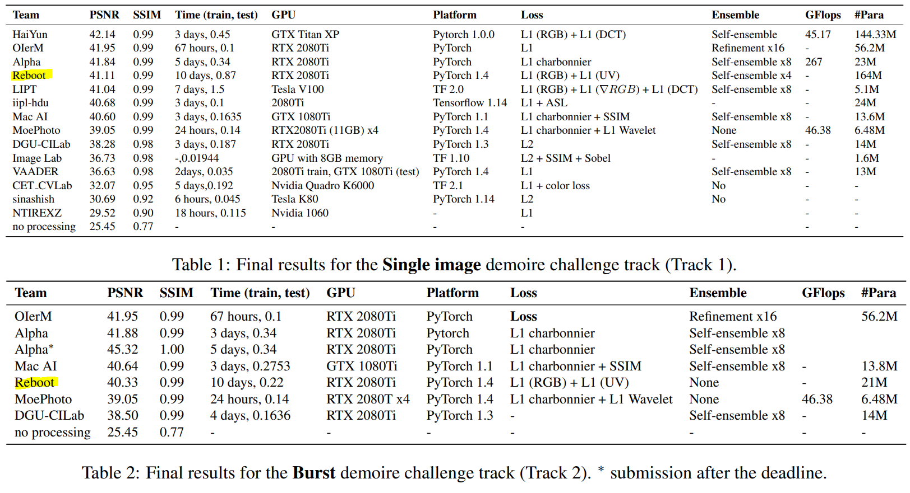

# C3Net
This is a PyTorch implementation of the [New Trends in Image Restoration and Enhancement workshop and challenges on image and video restoration and enhancement (NTIRE 2020 with CVPR 2020)](https://data.vision.ee.ethz.ch/cvl/ntire20/) paper, [C3Net: Demoireing Network Attentive in Channel, Color and Concatenation](http://openaccess.thecvf.com/content_CVPRW_2020/html/w31/Kim_C3Net_Demoireing_Network_Attentive_in_Channel_Color_and_Concatenation_CVPRW_2020_paper.html).

If you find our project useful in your research, please consider citing:
~~~
@InProceedings{Kim_2020_CVPR_Workshops,
author = {Kim, Sangmin and Nam, Hyungjoon and Kim, Jisu and Jeong, Jechang},
title = {C3Net: Demoireing Network Attentive in Channel, Color and Concatenation},
booktitle = {The IEEE/CVF Conference on Computer Vision and Pattern Recognition (CVPR) Workshops},
month = {June},
year = {2020}
}
~~~

# Dependencies
Python 3.6.9   
PyTorch 1.4.0 

# Data
[Reference](https://competitions.codalab.org/competitions/22223#participate-get_data)

You have to sign in Codalab and apply to **NTIRE 2020 Demoireing Challenge** before getting the data. 

# Proposed algorithm
   
   
   
   
   
   

# Training
Use the following command to use our training codes
~~~
python train.py
~~~
There are other options you can choose.
Please refer to train.py.

# Test
Use the following command to use our test codes
~~~
python test.py
~~~
There are other options you can choose.
Please refer to test.py.  

# Performance (PSNR/SSIM)

|Validation Server                                                                   |PSNR    |SSIM    |Rank    |
|:-----------------------------------------------------------------------------------|:-------|:-------|:-------|
|[Track 1: Single Image](https://competitions.codalab.org/competitions/22223#results)|41.30   |0.99    |9th     |
|[Track 2: Burst](https://competitions.codalab.org/competitions/22224#results)       |40.55   |0.99    |5th     |  

  
[Testing Server Reference](https://arxiv.org/pdf/2005.03155.pdf)
|Testing Server       |PSNR    |SSIM    |Rank   |
|:--------------------|:-------|:-------|:------|
|Track 1: Single Image|41.11   |0.99    |4th    |
|Track 2: Burst       |40.33   |0.99    |5th    |  

[Award Certificates](https://data.vision.ee.ethz.ch/cvl/ntire20/NTIRE2020_award_certificates.pdf)

  

# Contact
If you have any question about the code or paper, feel free to ask me to <ksmh1652@gmail.com>, <>.

# Acknowledgement
Thanks for [SaoYan](https://github.com/SaoYan/DnCNN-PyTorch) who gave the implementaion of DnCNN.  
Thanks for [yun_yang](https://github.com/jt827859032/DRRN-pytorch) who gave the implementation of DRRN.  
Thanks for [BumjunPark](https://github.com/BumjunPark/DHDN) who gave the implementation of DHDN.

Hint of color loss from [Jorge Pessoa](https://github.com/jorge-pessoa/pytorch-colors).  
Hint of concatenation and residual learning from [RDN (informal implementation)](https://github.com/lingtengqiu/RDN-pytorch).  
Hint of U-net block from [DIDN (formal implementation)](https://github.com/SonghyunYu/DIDN).  

C3Net started from [RUN](https://github.com/bmycheez/RUN).  

# More Details
To use heavier model, 
